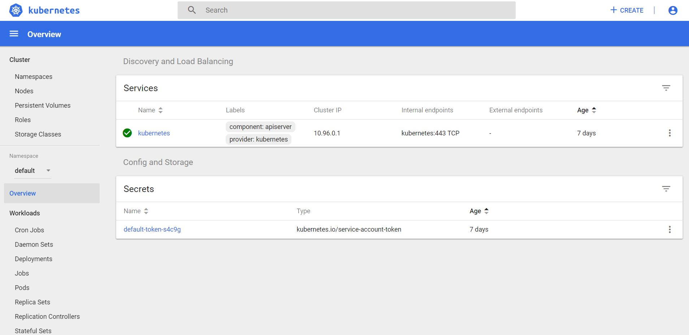

# Overview
Steps to guide you on how to deploy Kubernetes Dashboard in k8s cluster environment.

Dashboard is a web-based Kubernetes user interface that allows us to manage a k8s cluster (modify Deployments, Jobs, DaemonSets), monitor and troubleshoot app deployments, as well as deploy new deploy containerized applications.

Dashboard also provides information on the state of Kubernetes resources in your cluster and on any errors that may have occurred.

*This hands-on has been tested with Kubernetes Dashboard v1.10.1*

# Requirements
- K8s cluster configured. [Setup k8s multicluster](https://github.com/fabiosvaz/playground/tree/master/k8s/setup_kubeadm_multi_clusters) 

# Hands-on

## Deployment
The Dashboard deployment can be executed using kubectl poiting to the official recommended manifest file

```
kubectl apply -f https://raw.githubusercontent.com/kubernetes/dashboard/v1.10.1/src/deploy/recommended/kubernetes-dashboard.yaml
```

```
secret/kubernetes-dashboard-certs created
serviceaccount/kubernetes-dashboard created
role.rbac.authorization.k8s.io/kubernetes-dashboard-minimal created
rolebinding.rbac.authorization.k8s.io/kubernetes-dashboard-minimal created
deployment.apps/kubernetes-dashboard created
service/kubernetes-dashboard created
```

We can check if Dashboard was successfully deployed.

```
kubectl get pods -n kube-system -o wide | grep dashboard
```

```
NAMESPACE     NAME                                    READY   STATUS    RESTARTS   AGE     IP             NODE       NOMINATED NODE
kubernetes-dashboard-65c76f6c97-mx55j   1/1     Running   0          6m45s   192.168.1.30   worker1    <none>
```

You can also check Dashboard logs

```
kubectl get -n kube-system logs 
```

```
2019/01/23 03:24:40 Starting overwatch
2019/01/23 03:24:40 Using in-cluster config to connect to apiserver
2019/01/23 03:24:40 Using service account token for csrf signing
2019/01/23 03:24:40 Successful initial request to the apiserver, version: v1.12.4
2019/01/23 03:24:40 Generating JWE encryption key
2019/01/23 03:24:40 New synchronizer has been registered: kubernetes-dashboard-key-holder-kube-system. Starting
2019/01/23 03:24:40 Starting secret synchronizer for kubernetes-dashboard-key-holder in namespace kube-system
2019/01/23 03:24:41 Initializing JWE encryption key from synchronized object
2019/01/23 03:24:41 Creating in-cluster Heapster client
2019/01/23 03:24:41 Auto-generating certificates
2019/01/23 03:24:41 Metric client health check failed: the server could not find the requested resource (get services heapster). Retrying in 30 seconds.
2019/01/23 03:24:41 Successfully created certificates
2019/01/23 03:24:41 Serving securely on HTTPS port: 8443
```

## Access Configuration
Since Dashboard v1.7, no full admin privileges are granted by default. All the privileges are revoked and only minimal ones are granted.

For the purpose of this hands-on, we will be adding full admin privileges to Dashboard's Service Account

```
kubectl create -f https://raw.githubusercontent.com/fabiosvaz/playground/master/k8s/k8s_dashboard/k8s_dashboard_access.yaml
```

```
clusterrolebinding.rbac.authorization.k8s.io/kubernetes-dashboard created
```

From now on, you should not receive any warning message such as

```
configmaps is forbidden: User "system:serviceaccount:kube-system:kubernetes-dashboard" cannot list configmaps in the namespace "default"
```

## Access Dashboard via kubectl proxy
By default Dashboard will only be accessible locally, so we need to create a proxy server between our machine and Kubernetes API server. We will disable the proxy filter to accept all hosts.

```
kubectl proxy --disable-filter=true --address=0.0.0.0
```

```
Starting to serve on [::]:8001
```

Once you started proxy, you can now open a browser and access the Dashboard service via proxy.

```
http://localhost:8001/api/v1/namespaces/kube-system/services/https:kubernetes-dashboard:/proxy/
```

A sign in page should open and we will be using a Bearer token from the secret (kubernetes-dashboard) that was created in the Access Configuration section to authenticate and access Dashboard. 

```
kubectl get secrets --all-namespaces | grep kubernetes-dashboard
```

```
NAMESPACE     NAME                                             TYPE                                  DATA   AGE
kube-system   kubernetes-dashboard-token-q26vd                 kubernetes.io/service-account-token   3      65m
```

So now we can check the details of the secret and copy the token to be used in the sign in page

```
kubectl describe secret kubernetes-dashboard-token-q26vd -n kube-system
```

Once you sign in, you should see the Overview page of the dashboard.



# Heapster
As part of metric integration, Dashboard uses heapster to provide information about cpu and memory usage. It needs to be running in our cluster, otherwise a metric client health check will fail and Dashboard will skip the the metrics.

# References

https://github.com/kubernetes/dashboard
